설계 문서

#1. 클래스 다이어그램

```mermaid
classDiagram
    %% User Management Package
    namespace User_Management {
        class User {
            -String userId
            -String name
            +login() void
            +selectMenu() void
            +inputAction() void
        }
        class UserProfile {
            -int visionLevel
            -String appProficiency
            -Location location
            -int age
            +setFontSize(size: int) void
            +getProfileInfo() UserProfile
        }
        class ActionLog {
            -DateTime timestamp
            -String actionType
            -String screenContext
            -float dwellTime
            +saveLog() void
        }
    }

    %% Assistance Core System Package
    namespace Assistance_Core_System {
        class BehaviorMonitor {
            -float confusionScore
            -float threshold
            +trackInput(user: User) void
            +calculateConfusionScore() float
            +detectHesitation() boolean
            +identifyContext() String
        }
        class HelpContentManager {
            +getAdaptiveHelp(context: String) HelpContent
            +getManualHint(context: String) HelpContent
            +updateContent(content: HelpContent) void
            +getStatistics() StatReport
        }
        class HelpContent {
            -String contentId
            -String message
            -String audioUrl
            -HelpType type
            +displayPopup() void
            +playTTS() void
        }
        class ChatbotService {
            +processVoiceQuery(audio: Audio) String
            +searchFAQ(query: String) String
            +executeCommand(command: String) void
        }
    }

    %% Feature Services Package
    namespace Feature_Services {
        class TutorialSystem {
            -int currentStep
            +startTutorial(topic: String) void
            +checkStepCompletion(action: Action) boolean
            +provideFeedback(isCorrect: boolean) void
        }
        class FraudDetector {
            -List~String~ riskList
            +updateRiskList() void
            +checkAppSafety(packageName: String) boolean
            +checkUrlSafety(url: String) boolean
            +showOverlayWarning() void
        }
        class TrafficService {
            +getBusArrivalInfo(stationId: String) BusInfo
            +parseToEasyFormat(data: rawData) String
        }
        class WelfareService {
            +getCustomizedWelfare(profile: UserProfile) List~WelfareInfo~
            +filterByLocationAndAge() List~WelfareInfo~
        }
    }

    %% External Interfaces Package
    namespace External_Interfaces {
        class ExternalFraudAPI {
            <<interface>>
            +fetchFraudData() List~FraudItem~
        }
        class ExternalTrafficAPI {
            <<interface>>
            +fetchRealTimeBus(stationId: String) JSON
        }
        class ExternalWelfareAPI {
            <<interface>>
            +fetchWelfarePrograms() JSON
        }
    }

    %% Administration Package
    namespace Administration {
        class Administrator {
            -String adminId
            +login() void
            +manageHelpContent() void
            +viewDashboard() void
        }
    }

    %% Relationships
    User "1" *-- "1" UserProfile : owns
    User "1" --> "*" ActionLog : generates
    
    BehaviorMonitor --> User : monitors
    BehaviorMonitor --> HelpContentManager : requests help
    HelpContentManager --> HelpContent : manages
    
    User --> ChatbotService : asks
    User --> TutorialSystem : practices
    
    FraudDetector ..> ExternalFraudAPI : uses
    FraudDetector --> User : alerts
    
    TrafficService ..> ExternalTrafficAPI : uses
    WelfareService ..> ExternalWelfareAPI : uses
    WelfareService ..> UserProfile : reads
    
    Administrator --> HelpContentManager : manages
```

#2. 클래스 설명

## 3. 클래스 명세 (Class Specifications)

본 시스템의 주요 클래스 명세는 Java API Documentation 표준 형식을 따릅니다.

### 3.1 Package: User Management

#### Class `User`
* **Description**: 시스템을 사용하는 주체(Actor)인 고령자 사용자의 계정 정보와 기본 동작을 관리하는 클래스입니다.

**Field Summary**
| Modifier and Type | Field and Description |
| :--- | :--- |
| `private String` | **userId** 사용자를 식별하는 고유 ID입니다. |
| `private String` | **name** 사용자의 실명입니다. |

**Method Summary**
| Modifier and Type | Method and Description |
| :--- | :--- |
| `void` | **login()** 사용자 계정으로 시스템에 인증하고 접속합니다. |
| `void` | **selectMenu()** 메인 화면 또는 네비게이션 바에서 원하는 메뉴를 선택합니다. |
| `void` | **inputAction()** 화면의 버튼을 터치하거나 텍스트를 입력하는 등의 상호작용을 수행합니다. |

 

#### Class `UserProfile`
* **Description**: 사용자의 신체적 특성(시력) 및 개인화 정보(지역, 나이)를 관리하여 맞춤형 서비스를 제공하기 위한 데이터 클래스입니다.

**Field Summary**
| Modifier and Type | Field and Description |
| :--- | :--- |
| `private int` | **visionLevel** 사용자의 시력 저하 정도를 나타내며, UI 글자 크기 조정의 기준이 됩니다. |
| `private String` | **appProficiency** 앱 사용 숙련도(상/중/하)를 저장하여 도움말 빈도를 조절합니다. |
| `private Location` | **location** 복지 정보 추천을 위한 사용자의 거주지 정보입니다. |

**Method Summary**
| Modifier and Type | Method and Description |
| :--- | :--- |
| `void` | **setFontSize(int size)** `visionLevel`에 따라 앱의 전역 글자 크기를 설정합니다. |
| `UserProfile` | **getProfileInfo()** 현재 설정된 프로필 정보를 반환합니다. |

---

### 3.2 Package: Assistance Core System

#### Class `BehaviorMonitor`
* **Description**: 사용자의 입력 패턴과 체류 시간을 실시간으로 감시하여, 도움이 필요한 상황(머뭇거림)을 능동적으로 감지하는 제어 클래스입니다.

**Field Summary**
| Modifier and Type | Field and Description |
| :--- | :--- |
| `private float` | **confusionScore** 사용자의 행동(무입력 시간, 반복 터치 등)을 분석하여 계산된 혼란 점수입니다. |
| `private float` | **threshold** 도움말 팝업을 자동으로 실행시킬 혼란 점수의 임계값입니다. |

**Method Summary**
| Modifier and Type | Method and Description |
| :--- | :--- |
| `void` | **trackInput(User user)** 사용자의 터치 좌표 및 입력 간격을 실시간으로 추적합니다. |
| `float` | **calculateConfusionScore()** 현재 체류 시간과 오입력 횟수를 가중치 합산하여 혼란 점수를 계산합니다. |
| `boolean` | **detectHesitation()** 계산된 혼란 점수가 `threshold`를 초과하는지 판별합니다. |
| `String` | **identifyContext()** 현재 사용자가 머물고 있는 화면의 문맥(Context)을 식별합니다. |

 

#### Class `HelpContentManager`
* **Description**: 화면 상황에 맞는 도움말을 선별하여 제공하고, 관리자가 콘텐츠를 수정할 수 있도록 관리 기능을 제공하는 클래스입니다.

**Method Summary**
| Modifier and Type | Method and Description |
| :--- | :--- |
| `HelpContent` | **getAdaptiveHelp(String context)** 감지된 문맥에 최적화된 자동 도움말 객체를 반환합니다. |
| `HelpContent` | **getManualHint(String context)** 사용자가 힌트 버튼을 눌렀을 때 해당 단계의 핵심 팁을 반환합니다. |
| `void` | **updateContent(HelpContent content)** 관리자 요청에 따라 특정 화면의 도움말 문구 설명이나 오디오 파일을 갱신합니다. |
| `StatReport` | **getStatistics()** 도움말 이용 통계 리포트를 생성합니다. |

---

### 3.3 Package: Feature Services

#### Class `FraudDetector`
* **Description**: 외부 보안 API와 연동하여 보이스피싱 앱 설치 여부나 악성 URL 접근을 실시간으로 차단하는 보안 클래스입니다.

**Field Summary**
| Modifier and Type | Field and Description |
| :--- | :--- |
| `private List<String>` | **riskList** 외부 기관으로부터 수신한 악성 앱 패키지명 및 피싱 URL 블랙리스트입니다. |

**Method Summary**
| Modifier and Type | Method and Description |
| :--- | :--- |
| `void` | **updateRiskList()** `ExternalFraudAPI`를 호출하여 최신 위험 정보를 갱신합니다. |
| `boolean` | **checkAppSafety(String packageName)** 실행 중인 앱이 위험 목록에 있는지 확인합니다. |
| `void` | **showOverlayWarning()** 위험 감지 시 최상위 화면에 경고 오버레이를 표시합니다. |

 

#### Class `TutorialSystem`
* **Description**: 가상 환경(Sandbox) 내에서 단계별 과업 수행을 안내하고 학습 진행 상황을 관리하는 교육 시스템 클래스입니다.

**Method Summary**
| Modifier and Type | Method and Description |
| :--- | :--- |
| `void` | **startTutorial(String topic)** 특정 주제(예: 송금하기)의 튜토리얼 시나리오를 시작합니다. |
| `boolean` | **checkStepCompletion(Action action)** 사용자의 동작이 현재 단계의 정답과 일치하는지 확인합니다. |
| `void` | **provideFeedback(boolean isCorrect)** 정답/오답 여부에 따라 칭찬 메시지 혹은 재시도 안내를 제공합니다. |

 

#### Class `WelfareService`
* **Description**: 사용자의 프로필 정보(위치, 나이)를 기반으로 맞춤형 복지 및 문화 정보를 필터링하여 제공하는 서비스 클래스입니다.

**Method Summary**
| Modifier and Type | Method and Description |
| :--- | :--- |
| `List<WelfareInfo>` | **getCustomizedWelfare(UserProfile profile)** 외부 API로부터 전체 데이터를 수신합니다. |
| `List<WelfareInfo>` | **filterByLocationAndAge()** 수신된 데이터 중 사용자의 조건에 맞는 정보만 추출하여 반환합니다. |
