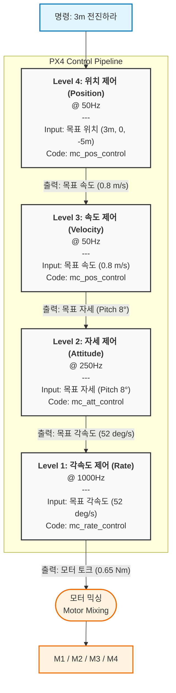

```mermaid
graph TD
    %% 스타일 정의 (색상 설정)
    classDef level fill:#f9f9f9,stroke:#333,stroke-width:2px,align:left;
    classDef input fill:#e1f5fe,stroke:#0277bd,stroke-width:2px;
    classDef motor fill:#fff3e0,stroke:#ef6c00,stroke-width:2px;

    %% 노드 정의 (텍스트에 따옴표 추가하여 오류 방지)
    Command["명령: 3m 전진하라"]

    subgraph "PX4 Control Pipeline"
        L4["<b>Level 4: 위치 제어 (Position)</b><br/>@ 50Hz<br/>---<br/>Input: 목표 위치 (3m, 0, -5m)<br/>Code: mc_pos_control"]
        
        L3["<b>Level 3: 속도 제어 (Velocity)</b><br/>@ 50Hz<br/>---<br/>Input: 목표 속도 (0.8 m/s)<br/>Code: mc_pos_control"]
        
        L2["<b>Level 2: 자세 제어 (Attitude)</b><br/>@ 250Hz<br/>---<br/>Input: 목표 자세 (Pitch 8°)<br/>Code: mc_att_control"]
        
        L1["<b>Level 1: 각속도 제어 (Rate)</b><br/>@ 1000Hz<br/>---<br/>Input: 목표 각속도 (52 deg/s)<br/>Code: mc_rate_control"]
    end

    Mixing(["모터 믹싱 <br/> Motor Mixing"])
    Motors["M1 / M2 / M3 / M4"]

    %% 연결 및 데이터 흐름
    Command --> L4
    L4 -- "출력: 목표 속도 (0.8 m/s)" --> L3
    L3 -- "출력: 목표 자세 (Pitch 8°)" --> L2
    L2 -- "출력: 목표 각속도 (52 deg/s)" --> L1
    L1 -- "출력: 모터 토크 (0.65 Nm)" --> Mixing
    Mixing --> Motors

    %% 스타일 적용 (안전하게 마지막에 적용)
    class Command input;
    class L4,L3,L2,L1 level;
    class Mixing,Motors motor;
```
