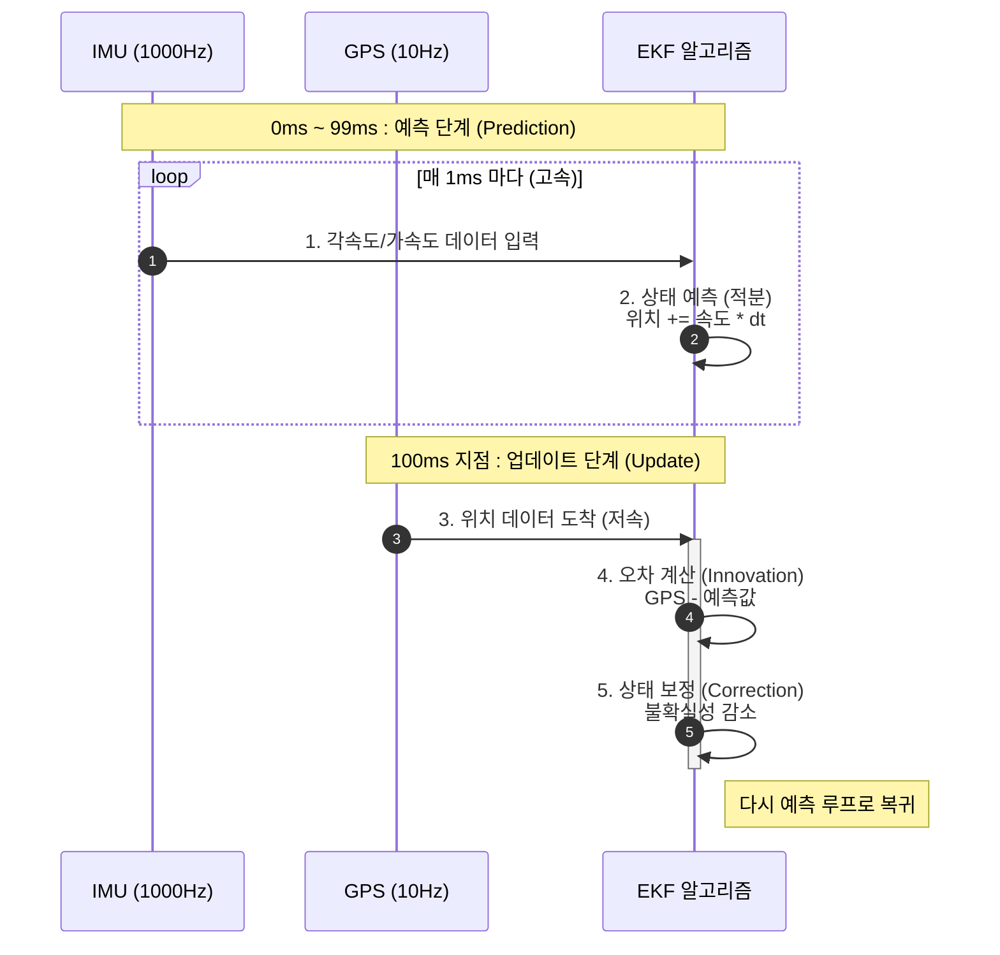

```mermaid

sequenceDiagram
    autonumber
    participant IMU as IMU (1000Hz)
    participant GPS as GPS (10Hz)
    participant EKF as EKF 알고리즘

    Note over IMU, EKF: 0ms ~ 99ms : 예측 단계 (Prediction)
    
    loop 매 1ms 마다 (고속)
        IMU->>EKF: 1. 각속도/가속도 데이터 입력
        EKF->>EKF: 2. 상태 예측 (적분)<br/>위치 += 속도 * dt
    end

    Note over GPS, EKF: 100ms 지점 : 업데이트 단계 (Update)

    GPS->>EKF: 3. 위치 데이터 도착 (저속)
    activate EKF
    EKF->>EKF: 4. 오차 계산 (Innovation)<br/>GPS - 예측값
    EKF->>EKF: 5. 상태 보정 (Correction)<br/>불확실성 감소
    deactivate EKF
    
    Note right of EKF: 다시 예측 루프로 복귀
```
