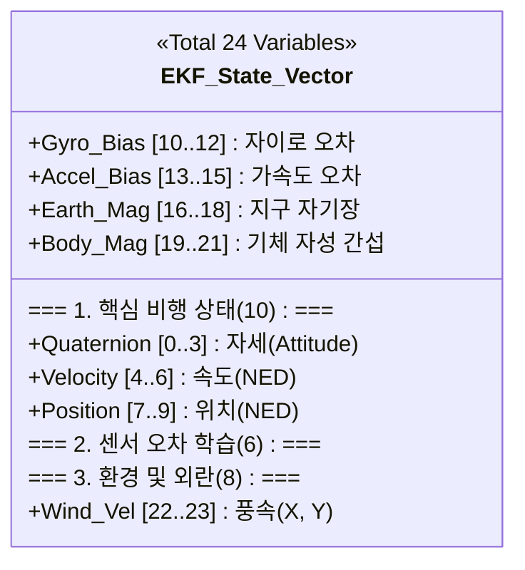

```mermaid

classDiagram
    class EKF_State_Vector {
        <<Total 24 Variables>>
        === 1. 핵심 비행 상태 (10) ===
        +Quaternion [0..3] : 자세 (Attitude)
        +Velocity [4..6] : 속도 (NED)
        +Position [7..9] : 위치 (NED)
        === 2. 센서 오차 학습 (6) ===
        +Gyro_Bias [10..12] : 자이로 오차
        +Accel_Bias [13..15] : 가속도 오차
        === 3. 환경 및 외란 (8) ===
        +Earth_Mag [16..18] : 지구 자기장
        +Body_Mag [19..21] : 기체 자성 간섭
        +Wind_Vel [22..23] : 풍속 (X, Y)
    }
```
