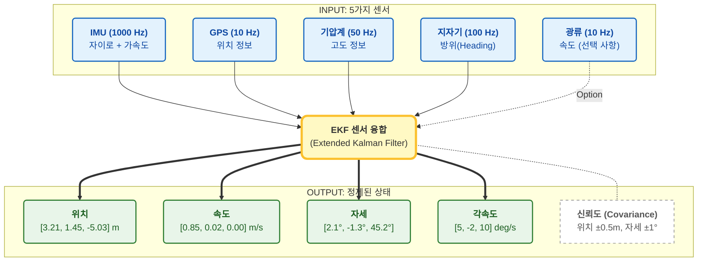

```mermaid


graph TD
    %% --- 스타일 정의 (색상 및 테두리 설정) ---
    classDef inputNode fill:#e3f2fd,stroke:#1565c0,stroke-width:2px,color:#0d47a1,rx:5,ry:5;
    classDef processNode fill:#fff9c4,stroke:#fbc02d,stroke-width:4px,color:#333,rx:10,ry:10;
    classDef outputNode fill:#e8f5e9,stroke:#2e7d32,stroke-width:2px,color:#1b5e20,rx:5,ry:5;
    classDef metaNode fill:#ffffff,stroke:#757575,stroke-width:1px,stroke-dasharray: 5 5,color:#555;

    %% --- 1. 입력 단계 (센서) ---
    subgraph Input_Layer [INPUT: 5가지 센서]
        direction TB
        %% 센서 노드 정의 (HTML 태그로 줄바꿈 및 강조)
        IMU["<b>IMU (1000 Hz)</b><br/>자이로 + 가속도"]:::inputNode
        GPS["<b>GPS (10 Hz)</b><br/>위치 정보"]:::inputNode
        Baro["<b>기압계 (50 Hz)</b><br/>고도 정보"]:::inputNode
        Mag["<b>지자기 (100 Hz)</b><br/>방위(Heading)"]:::inputNode
        Flow["<b>광류 (10 Hz)</b><br/>속도 (선택 사항)"]:::inputNode
    end

    %% --- 2. 처리 단계 (EKF) ---
    %% 중심 노드
    EKF("<b>EKF 센서 융합</b><br/>(Extended Kalman Filter)"):::processNode

    %% --- 3. 출력 단계 (정제된 데이터) ---
    subgraph Output_Layer [OUTPUT: 정제된 상태]
        direction TB
        Pos["<b>위치</b><br/>[3.21, 1.45, -5.03] m"]:::outputNode
        Vel["<b>속도</b><br/>[0.85, 0.02, 0.00] m/s"]:::outputNode
        Att["<b>자세</b><br/>[2.1°, -1.3°, 45.2°]"]:::outputNode
        Rate["<b>각속도</b><br/>[5, -2, 10] deg/s"]:::outputNode
        
        %% 신뢰도 정보 (별도 스타일)
        Conf["<b>신뢰도 (Covariance)</b><br/>위치 ±0.5m, 자세 ±1°"]:::metaNode
    end

    %% --- 연결선 정의 ---
    %% 센서 -> EKF 연결
    IMU --> EKF
    GPS --> EKF
    Baro --> EKF
    Mag --> EKF
    Flow -.->|Option| EKF

    %% EKF -> 출력 연결
    EKF ==> Pos
    EKF ==> Vel
    EKF ==> Att
    EKF ==> Rate
    EKF -.- Conf
```
