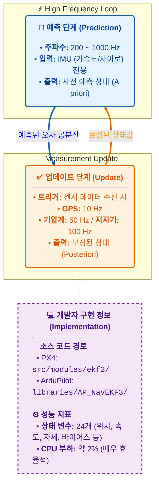

```mermaid

graph TD
    %% --- 스타일 정의 ---
    classDef predNode fill:#e3f2fd,stroke:#1565c0,stroke-width:2px,color:#0d47a1,rx:5,ry:5;
    classDef updateNode fill:#fff3e0,stroke:#ef6c00,stroke-width:2px,color:#e65100,rx:5,ry:5;
    classDef specNode fill:#f3e5f5,stroke:#7b1fa2,stroke-width:2px,stroke-dasharray: 5 5,color:#4a148c;

    %% --- 1. 예측 단계 (High Frequency) ---
    subgraph Fast_Loop [⚡ High Frequency Loop]
        direction TB
        PRED("<b>🔄 예측 단계 (Prediction)</b><hr/>• <b>주파수:</b> 200 ~ 1000 Hz<br/>• <b>입력:</b> IMU (가속도/자이로) 전용<br/>• <b>출력:</b> 사전 예측 상태 (A priori)"):::predNode
    end

    %% --- 2. 업데이트 단계 (Lower Frequency) ---
    subgraph Event_Loop [📡 Measurement Update]
        direction TB
        UPDATE("<b>✅ 업데이트 단계 (Update)</b><hr/>• <b>트리거:</b> 센서 데이터 수신 시<br/>• <b>GPS:</b> 10 Hz<br/>• <b>기압계:</b> 50 Hz / <b>지자기:</b> 100 Hz<br/>• <b>출력:</b> 보정된 상태 (Posteriori)"):::updateNode
    end

    %% --- 3. 구현 스펙 (System Specs) ---
    SPEC["<b>💻 개발자 구현 정보 (Implementation)</b><hr/><div style='text-align:left'><b>📂 소스 코드 경로</b><br/>&nbsp;&nbsp;• PX4: <code>src/modules/ekf2/</code><br/>&nbsp;&nbsp;• ArduPilot: <code>libraries/AP_NavEKF3/</code><br/><br/><b>⚙️ 성능 지표</b><br/>&nbsp;&nbsp;• <b>상태 변수:</b> 24개 (위치, 속도, 자세, 바이어스 등)<br/>&nbsp;&nbsp;• <b>CPU 부하:</b> 약 2% (매우 효율적)</div>"]:::specNode

    %% --- 데이터 흐름 연결 ---
    PRED ==>|예측된 오차 공분산| UPDATE
    UPDATE ==>|보정된 상태값| PRED
    
    %% --- 스펙 정보 연결 (시각적 배치용) ---
    UPDATE -.- SPEC

    %% --- 주석: 루프 설명 ---
    linkStyle 0 stroke:#1565c0,stroke-width:3px,color:blue;
    linkStyle 1 stroke:#ef6c00,stroke-width:3px,color:orange;
```
