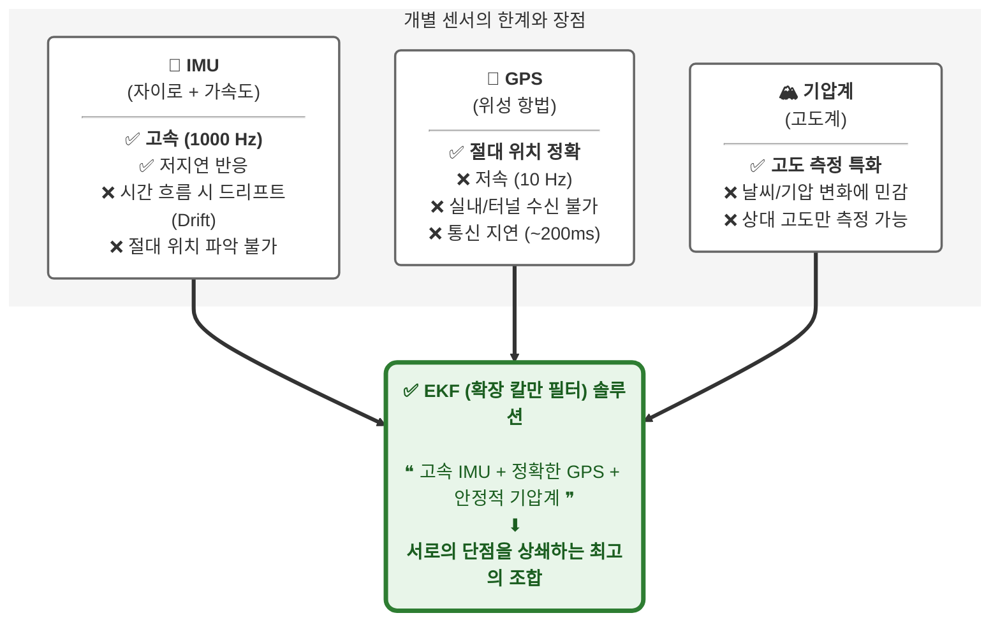

```mermaid


graph TD
    %% --- 스타일 정의 ---
    classDef cardNode fill:#ffffff,stroke:#666,stroke-width:2px,rx:5,ry:5,color:#333,text-align:left;
    classDef solutionNode fill:#e8f5e9,stroke:#2e7d32,stroke-width:4px,rx:10,ry:10,color:#1b5e20;
    
    %% --- 센서 1: IMU ---
    IMU["<div style='text-align:center'><b>🚀 IMU</b><br/>(자이로 + 가속도)</div><hr/>✅ <b>고속 (1000 Hz)</b><br/>✅ 저지연 반응<br/><span style='color:red'>❌ 시간 흐름 시 드리프트(Drift)</span><br/><span style='color:red'>❌ 절대 위치 파악 불가</span>"]:::cardNode

    %% --- 센서 2: GPS ---
    GPS["<div style='text-align:center'><b>📡 GPS</b><br/>(위성 항법)</div><hr/>✅ <b>절대 위치 정확</b><br/><span style='color:red'>❌ 저속 (10 Hz)</span><br/><span style='color:red'>❌ 실내/터널 수신 불가</span><br/><span style='color:red'>❌ 통신 지연 (~200ms)</span>"]:::cardNode

    %% --- 센서 3: 기압계 ---
    BARO["<div style='text-align:center'><b>🏔️ 기압계</b><br/>(고도계)</div><hr/>✅ <b>고도 측정 특화</b><br/><span style='color:red'>❌ 날씨/기압 변화에 민감</span><br/><span style='color:red'>❌ 상대 고도만 측정 가능</span>"]:::cardNode

    %% --- 해결책: EKF ---
    EKF("<b>✅ EKF (확장 칼만 필터) 솔루션</b><br/><br/>❝ 고속 IMU + 정확한 GPS + 안정적 기압계 ❞<br/>⬇<br/><b>서로의 단점을 상쇄하는 최고의 조합</b>"):::solutionNode

    %% --- 연결선 ---
    IMU ==> EKF
    GPS ==> EKF
    BARO ==> EKF

    %% --- 배경 그룹 (선택사항) ---
    subgraph Inputs [개별 센서의 한계와 장점]
        direction LR
        IMU
        GPS
        BARO
    end
    
    style Inputs fill:#f5f5f5,stroke:none

```
