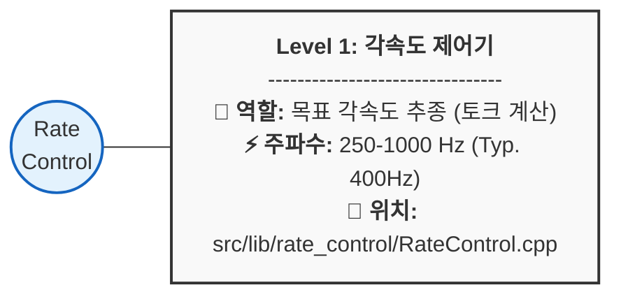

```mermaid
graph LR
    %% 스타일 정의 (가독성을 위한 색상 및 정렬)
    classDef infoBox fill:#f9f9f9,stroke:#333,stroke-width:2px,align:left;
    classDef icon fill:#e3f2fd,stroke:#1565c0,stroke-width:2px;

    %% 노드 정의
    Icon((Rate<br/>Control))
    
    Detail["<b>Level 1: 각속도 제어기</b><br/>--------------------------------<br/><b>🎯 역할:</b> 목표 각속도 추종 (토크 계산)<br/><b>⚡ 주파수:</b> 250-1000 Hz (Typ. 400Hz)<br/><b>📂 위치:</b> src/lib/rate_control/RateControl.cpp"]

    %% 연결 (시각적 그룹화)
    Icon --- Detail

    %% 스타일 적용
    class Detail infoBox;
    class Icon icon;
```
