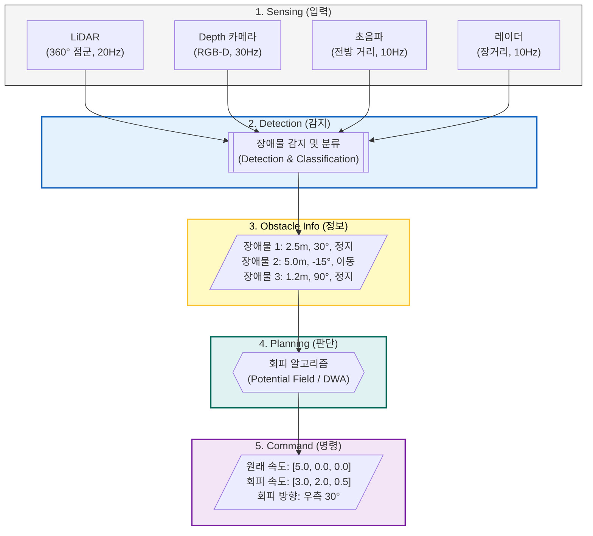

```mermaid

flowchart TD
    %% 1. 입력 단계
    subgraph Input ["1. Sensing (입력)"]
        direction TB
        LiDAR["LiDAR<br/>(360° 점군, 20Hz)"]
        DepthCam["Depth 카메라<br/>(RGB-D, 30Hz)"]
        Ultrasonic["초음파<br/>(전방 거리, 10Hz)"]
        Radar["레이더<br/>(장거리, 10Hz)"]
    end

    %% 2. 처리 단계
    subgraph Process ["2. Detection (감지)"]
        Detect[["장애물 감지 및 분류<br/>(Detection & Classification)"]]
    end

    %% 3. 정보 단계
    subgraph Info ["3. Obstacle Info (정보)"]
        ObsList[/"장애물 1: 2.5m, 30°, 정지<br/>장애물 2: 5.0m, -15°, 이동<br/>장애물 3: 1.2m, 90°, 정지"/]
    end

    %% 4. 알고리즘 단계
    subgraph Algo ["4. Planning (판단)"]
        Avoidance{{"회피 알고리즘<br/>(Potential Field / DWA)"}}
    end

    %% 5. 출력 단계
    subgraph Output ["5. Command (명령)"]
        Cmd[/"원래 속도: [5.0, 0.0, 0.0]<br/>회피 속도: [3.0, 2.0, 0.5]<br/>회피 방향: 우측 30°"/]
    end

    %% 연결
    LiDAR --> Detect
    DepthCam --> Detect
    Ultrasonic --> Detect
    Radar --> Detect

    Detect --> ObsList
    ObsList --> Avoidance
    Avoidance --> Cmd

    %% 스타일링 (오류 수정됨)
    style Input fill:#f5f5f5,stroke:#333,stroke-width:1px
    style Process fill:#e3f2fd,stroke:#1565c0,stroke-width:2px
    style Info fill:#fff9c4,stroke:#fbc02d,stroke-width:2px,color:#000
    style Algo fill:#e0f2f1,stroke:#00695c,stroke-width:2px
    style Output fill:#f3e5f5,stroke:#7b1fa2,stroke-width:2px
```
